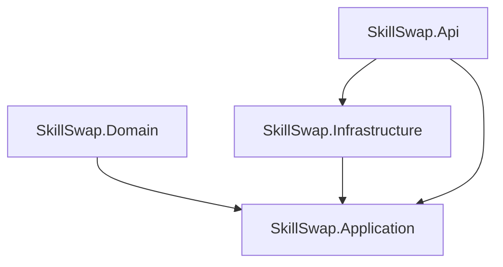

# 🛠️ Development Guide for SkillSwap

Welcome to the **SkillSwap Guild Hall** developer workbook! Follow this detailed manual to initialize your local development node, start the spatial database, run the multi-layered .NET API, and launch the React JRPG frontend.

---

## 📋 Prerequisites

Before coding, ensure you have the following toolkits active on your machine:

1. **.NET Core SDK 10.0+**
   - Verify: `dotnet --version`
2. **Node.js 20+ & NPM**
   - Verify: `node --version` && `npm --version`
3. **PostgreSQL 15+ with PostGIS extension**
   - Required for spatial/geographic range queries.

---

## 🐘 Spatial Database Setup (PostGIS)

The backend utilizes high-performance PostGIS spatial queries (`ST_DWithin` and `ST_Distance`) to identify tasks near the user.

### Option A: Using Docker (Highly Recommended)
Launch a pre-configured PostGIS container in one line:
```bash
docker run --name skillswap-db \
  -e POSTGRES_USER=postgres \
  -e POSTGRES_PASSWORD=postgres \
  -e POSTGRES_DB=skillswap \
  -p 5432:5432 \
  -d postgis/postgis:15-3.3-alpine
```

### Option B: Local PostgreSQL Installation
If running locally, ensure you enable the PostGIS extension inside your database using an SQL terminal:
```sql
CREATE EXTENSION postgis;
```

---

## 🛠️ Step-by-Step Installation

### 1. Restore & Build the C# Backend
Verify that your C# backend builds successfully:
```bash
make build-backend
```

### 2. Apply Database Migrations
Run the EF Core schema updater to build target tables (with spatial `LocationPoint` parameters):
```bash
make db-migrate
```

### 3. Set Up Frontend Node Packages
Restore all React and TailwindCSS dependencies:
```bash
make install
```

---

## 🚀 Running the Local Environment

Use the integrated `Makefile` entries to spin up the servers:

### Spin Up ASP.NET Web API (Port 5107)
```bash
make dev-backend
```
*Once running, navigate to `http://localhost:5107/openapi/v1.json` or check out the interactive Scalar OpenAPI UI.*

### Spin Up Vite React Frontend (Port 5173)
In a separate terminal tab, run:
```bash
make dev-frontend
```
*Open `http://localhost:5173` to explore the beautiful cozy JRPG skill-trading guild.*

---

## 🏰 Architectural Overview

SkillSwap uses clean architecture with strict separation of concerns:



- **Domain**: Contains aggregates like `Task`, value objects (`Location`, `Money`), and domain events.
- **Application**: Mediates CQRS queries and commands using `MediatR` (e.g. `CreateTaskCommand`).
- **Infrastructure**: Deals with Entity Framework DbContext, NetTopologySuite geometric parsing, and PostGIS searches.
- **Api**: A lightweight, minimal API layer mapping endpoints directly to commands/queries.
