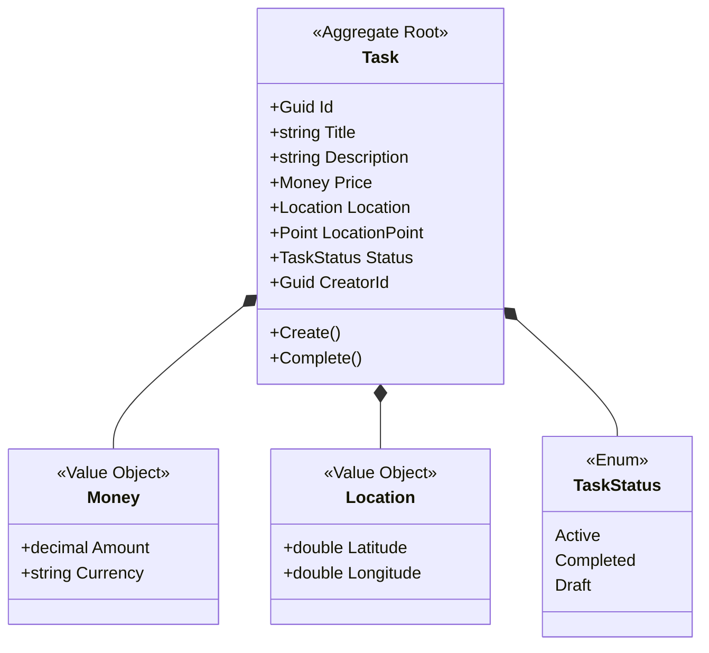

# 🌟 SkillSwap: Cozy JRPG-Style Skill Trading Guild

<div align="center">
  

  <p align="center">
    <strong>A cozy, pixel-art JRPG styled monorepo for direct skill trading, equipped with high-performance PostGIS geographical queries and interactive Bezier-curved mind-maps.</strong>
  </p>

  <p align="center">
    
    
    
  </p>

  <p align="center">
    <a href="#-features">Key Features</a> •
    <a href="#%EF%B8%8F-tech-stack">Tech Stack</a> •
    <a href="#-architecture">Architecture</a> •
    <a href="DEVELOPMENT.md">Developer Guide</a> •
    <a href="#-license">License</a>
  </p>
</div>

---

## 📖 Introduction & Concept

**SkillSwap** transforms traditional service exchange platforms into an immersive **cozy retro JRPG adventure**! Rather than standard forms, users traverse the map as "adventurers", posting skill "bounties", negotiating trades inside CRT JRPG dialogue screens, and building their local community guild. 

Designed with warm cream parchment menus, dynamic vine lines, and acorns controls, it brings tactile joy to geographical services.

---

## 🎨 Interface Preview

<div align="center">
  
</div>

---

## ✨ Features

- **🗺️ Interactive JRPG Cartography**: Fully responsive maps complete with vintage pixel icons, enabling location-scoped tasks nearby.
- **🌿 Bezier-Curved Skill Vines**: An interactive mind-map where skills sprout as acorns along dynamic vine paths, guiding users to trade.
- **🦖 CRT JRPG Dialogue Boxes**: Interactive, tactile dialogue box wizard pipelines replacing boring web forms.
- **🛰️ PostGIS Proximity Engine**: High-performance `.NET` geo-queries utilizing NetTopologySuite to filter tasks based on precise coordinates.
- **🪵 Acorn Slider Controls**: Custom styled input parameters and retro sliders for maximum tactile visual excellence.

---

## 🛠️ Tech Stack

### Frontend Guild (Web)
- **Framework**: React 19 (TypeScript)
- **Bundler**: Vite 8 (Modern ES modules, lightning-fast compilation)
- **Styling**: Cozy HSL Custom Vanilla CSS & TailwindCSS v4
- **State Management**: Zustand (Minimalist global stores)
- **Client Cache**: TanStack React Query v5

### Backend Guard (API)
- **Runtime**: .NET Core 10.0 (Fast, lightweight compilation)
- **Architecture**: Domain-Driven Design (DDD) & Clean Architecture
- **DB Interface**: Entity Framework Core with Npgsql PostgreSQL Provider
- **Mediation**: MediatR CQRS Command / Query architecture
- **Documenting**: Scalar OpenAPI 3.0 interactive dashboard

---

## 🏰 Database & Architecture Schema

Here is the domain object schema representing PostGIS geographic queries, price value objects, and active tasks:



- **LocationPoint** contains `NetTopologySuite.Geometries.Point`, which maps directly to a high-speed spatial indexing geography column in **PostgreSQL/PostGIS**.

---

## 🚀 Quick Setup

To spin up the JRPG guild house locally:

1. **Spin up PostgreSQL with PostGIS extension**:
   ```bash
   docker run --name pg-postgis -e POSTGRES_PASSWORD=postgres -e POSTGRES_DB=skillswap -p 5432:5432 -d postgis/postgis:15-3.3-alpine
   ```
2. **Compile and run local services**:
   ```bash
   make install        # Install web modules
   make db-migrate     # Run EF core database migrations
   make build          # Build whole monorepo
   ```
3. **Launch servers**:
   - Web App: `make dev-frontend` (available on `http://localhost:5173`)
   - C# Web API: `make dev-backend` (available on `http://localhost:5107`)

*For complete details, explore our full [Developer Runbook (DEVELOPMENT.md)](DEVELOPMENT.md).*

---

## 📜 License

Licensed under the [MIT License](LICENSE) - © 2026 Порсев Михаил.
Guild elements crafted with premium love. Welcome to the Guild! 🍻